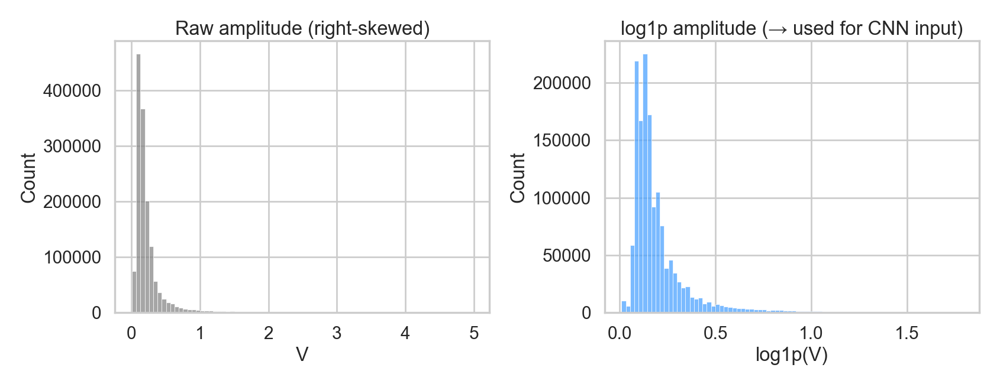
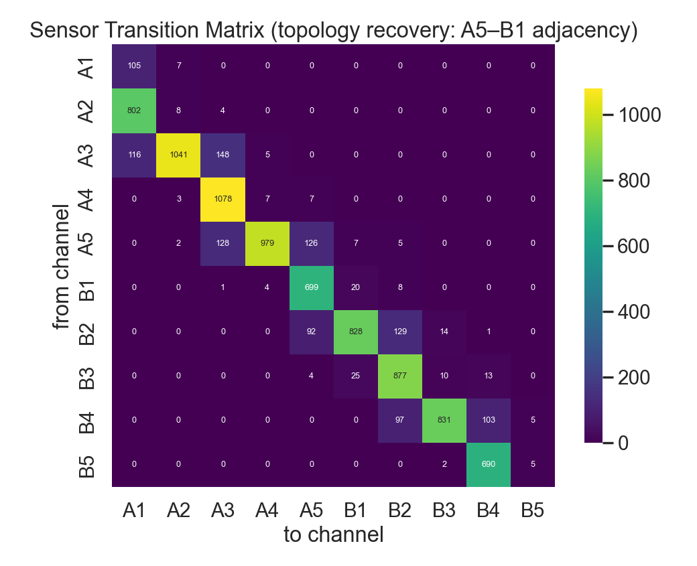
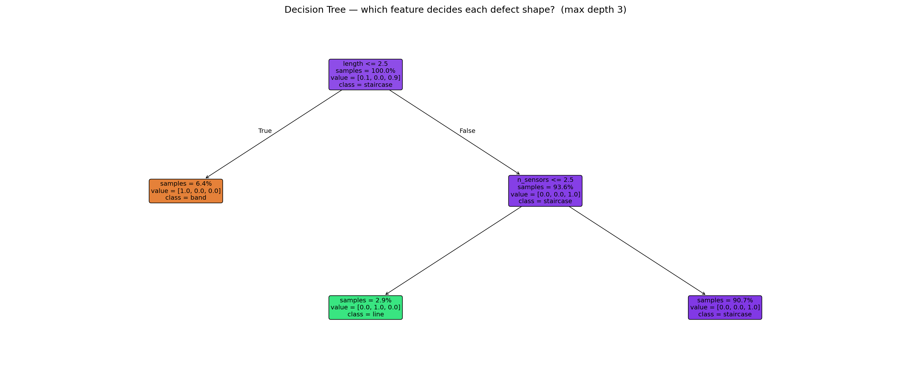
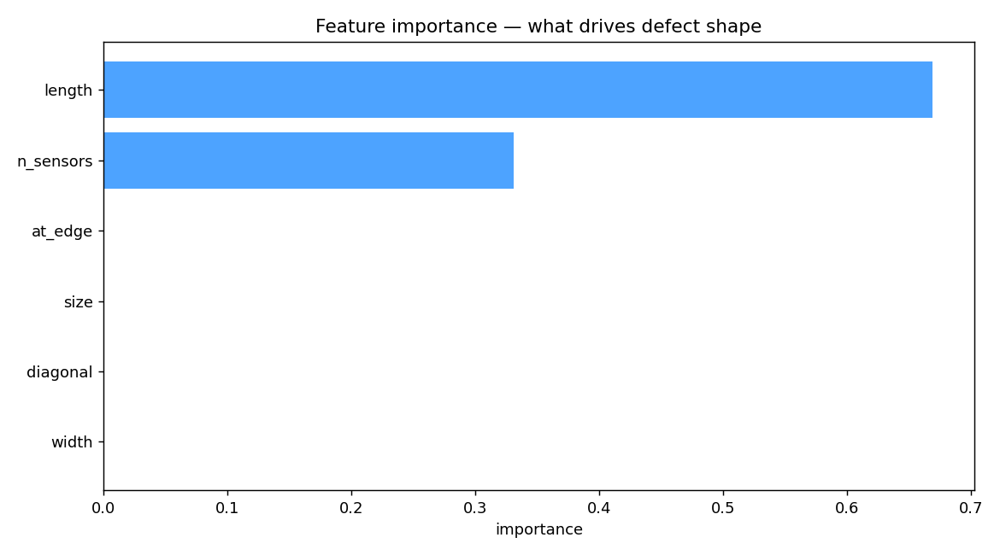
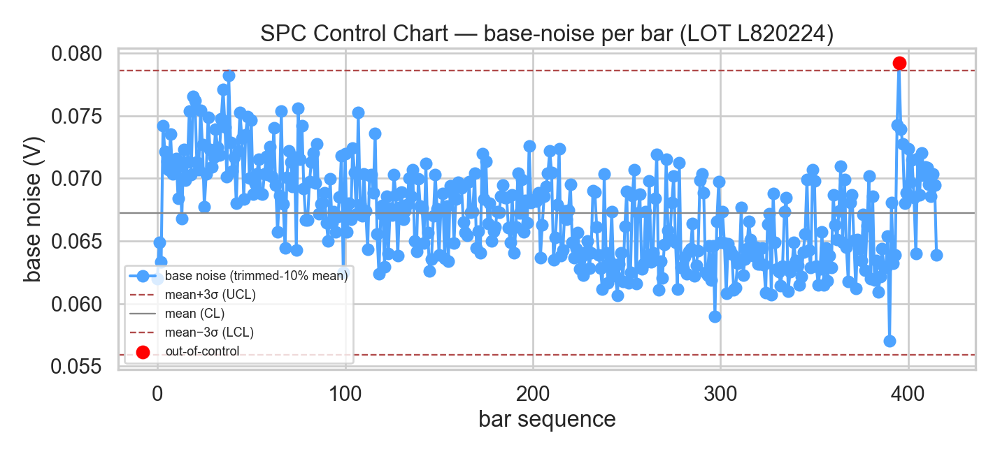
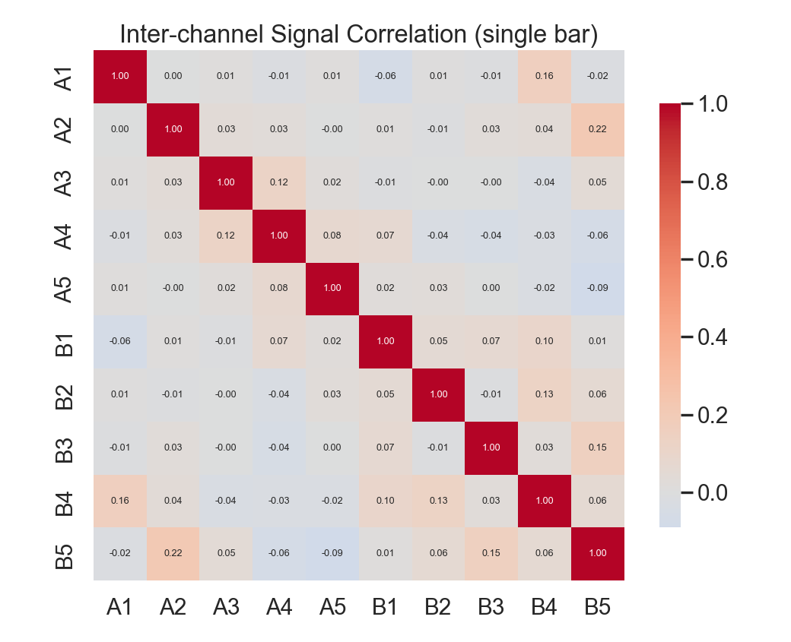
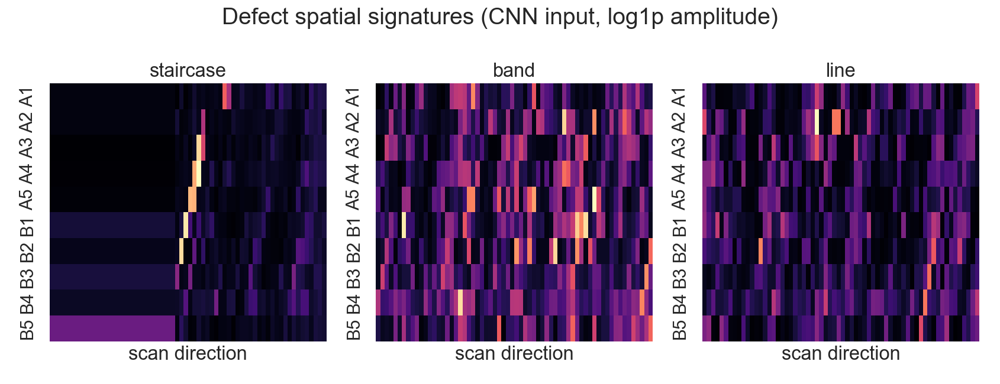

# MFL 2.0 — Defect Signature Classification
**누설자속탐상(MFL) 결함 신호의 공간 패턴 분류 — 장비 임계룰 너머의 failure signature 식별**

장비가 진폭 임계로 "결함 유무"를 판정한 *그 다음 단계*를 다룬다. 결함 스파이크의 **공간 signature(형태·방향)** 를 분류해, 단순 양·불 판정이 아닌 failure mode 후보를 식별함.

핵심은 모델이 아니라 **접근 방식**이다 — *장비가 결함이라 찍은 것을 의심하고, 데이터로 원인을 추적하고, 높은 점수가 나와도 안주하지 않고 검증하며 문제를 다시 정의*한 기록. (반도체 Product Engineering 직무와의 연결은 §8)

---

## 1. 문제 정의

MFL 검사 장비는 진폭 임계(REJECT H: 1.5V / 26mm)로 결함 이벤트를 자가판정함. 따라서 **"결함 유무" 분류는 임계 한 줄(trivial)** 이라 ML로 풀 가치가 낮음. 문제를 두 단계로 재정의함:

- **1차** — 임계를 넘은 결함 후보(component) 중 **구조적 결함 후보(structured) vs 고립 노이즈성 artifact(isolated)** 분리
- **2차** — 구조적 결함의 **형태 분류**: `staircase`(대각 진행) / `band`(원주방향) / `line`(길이방향). 형태가 결함 원인(root cause)의 단서가 됨

핵심: structured와 isolated, 그리고 세 형태는 **진폭이 모두 임계를 넘음** → 진폭(임계)으로는 못 가름. 오직 **공간 패턴**으로만 갈림 → 2D CNN의 필요성이 데이터로 성립함.

## 2. 데이터와 신호 형상

- 강철바 MFL 비파괴검사. 86일 / 878 LOT / 약 85,000 bar
- 각 bar = 길이방향 스캔(약 507 point) × 10채널 (A1–A5 **상단**, B1–B5 **하단**)
- 라벨: 장비 자가판정(임계) 출발 → 형태 규칙 기반 **weak label** 설계 (정답 라벨 아님)

**신호 형상 — staircase의 정체:** 강철바가 회전(462rpm)하며 통과하므로, 하나의 물리적 결함이 센서들을 *시간차를 두고 순차적으로* 자극함. 그 결과 결함 스파이크가 2D 맵 위에서 대각선 궤적을 그림:

```
        A1   A2   A3   A4   A5   B1   B2   B3   B4   B5
t0:    0.1  0.1  0.1  0.1  0.1  2.8  0.1  0.1  0.1  0.1
t1:    0.1  0.1  0.1  0.1  2.3  0.1  0.1  0.1  0.1  0.1     ← 결함이 회전하며
t2:    0.1  0.1  0.1  2.1  0.1  0.1  0.1  0.1  0.1  0.1        센서를 순차 자극
   (베이스 0.1V vs 결함 스파이크 2~3V / 나머지 칸도 빈 게 아니라 정상 베이스 신호)
```

세 형태: `staircase`(위처럼 대각) / `band`(같은 t에서 여러 채널 동시 = 원주방향) / `line`(한 채널에서 길이방향 연속).

> **시각 자료 (추후 보완 예정)**: bar 신호맵 heatmap · staircase/band/line 형태 예시 · confusion matrix · 채널셔플 전후 비교

## 3. 주요 엔지니어링 결정 (테크닉 + 근거)

이 프로젝트의 핵심은 모델이 아니라 **각 결정의 근거**다. "왜 이렇게 했나"를 데이터로 검증함.

### 3.1 입력 표현
- **log1p 진폭** — 처음엔 채널별 robust z-score(median/MAD)를 썼으나, 그것이 결함 스파이크와 *채널 간 상대크기*를 죽여 macro-F1이 무너짐(0.337). `log1p`로 교체하자 스파이크·상대크기가 보존되며 **0.337 → 0.813 도약**. *정규화 선택 하나가 성능을 가른 사례.*
- **4채널 `[amp, mask, d_len, d_ch]`** — 진폭 외에 임계 mask와 **gradient 2채널**(길이/채널 방향 변화율)을 추가해 결함 경계·방향성을 강조. gradient + 데이터 확대가 2차 macro-F1을 0.728 → 0.894로 견인.

### 3.2 component 추출 & 입력 텐서
- `scipy.ndimage` **8-connectivity**로 임계초과 셀을 결함 덩어리(component)로 분리
- component 중심 ±32 → **`(64, 10)` 고정 패치**, 경계는 `replicate` padding

**CNN 입력 텐서 최종 형태 — `(4, 64, 10)`:**

| 채널 | 내용 | 역할 |
|---|---|---|
| 0 | log1p 진폭 | 신호 세기 (스파이크·채널 간 상대크기 보존) |
| 1 | 임계 mask (>1.5V) | 결함 후보 위치 명시 |
| 2 | 길이방향 gradient | 길이 방향 경계·변화율 |
| 3 | 채널방향 gradient | 센서 간 경계·방향성 |

`64` = 길이방향 패치 길이, `10` = 센서 채널(원주순서 A1–A5, B1–B5).

### 3.3 센서 topology 역추정 (도메인 지식을 데이터로 복원)
- 장비 표기(A/B 2×5)를 그대로 안 믿고, **약 30만 component의 채널 전이 빈도**를 집계
- 결과: `A1–A2–A3–A4–A5–B1–B2–B3–B4–B5` 원주순서가 하나의 사슬, 특히 **A5–B1 인접(5,873회)** 확인
- **B5–A1 전이는 0** → 원주 폐곡선이 아닌 *열린 사슬* → `circular` padding이 아니라 `replicate`가 맞음을 데이터로 검증
- 입력 채널을 이 원주순서로 배열 → staircase가 끊기지 않고 대각선으로 보존

### 3.4 weak label 설계
- 형태 규칙: 채널중심이 단조 이동(diagonal) → `staircase`, 다채널·짧은 row → `band`, 긴 row·소채널 → `line`, 작은 고립점 → `isolated`
- 회색지대(`ambiguous`)는 학습에서 **제외**해 label noise 감소
- *정답이 아닌 weak label임을 명시* — failure mode "후보"로 표현

### 3.5 모델 & 학습
- **2D CNN**: 3× (Conv 3×3 → BatchNorm → GELU) + Dropout, 채널 48/96/192, `replicate` padding, adaptive average pool → FC
- **class weight** (불균형: staircase 108k / band 5.9k / line 3.4k)
- **cosine LR schedule** + **label smoothing 0.05**

**손실함수 — soft-F1 직접 최적화.** 평가지표가 macro-F1인데, F1은 argmax(이산)이라 미분 불가능함. 그래서 예측 확률 $p$로 TP/FP/FN을 연속화해 **미분가능한 soft-F1**을 만들고, 이를 직접 경사하강함 (*지표와 손실의 일치*).

클래스 $c$에 대해, 예측 확률 $p_{i,c}$ 와 one-hot 정답 $y_{i,c}$ 로 soft confusion 항을 정의:

$$\mathrm{TP}_c=\sum_i p_{i,c}\,y_{i,c},\qquad \mathrm{FP}_c=\sum_i p_{i,c}\,(1-y_{i,c}),\qquad \mathrm{FN}_c=\sum_i (1-p_{i,c})\,y_{i,c}$$

$$\text{soft-}F1_c=\frac{2\,\mathrm{TP}_c}{2\,\mathrm{TP}_c+\mathrm{FP}_c+\mathrm{FN}_c+\epsilon},\qquad \mathcal{L}_{\text{soft-}F1}=1-\frac{1}{C}\sum_{c=1}^{C}\text{soft-}F1_c$$

학습 안정성을 위해 weighted cross-entropy와 혼합:

$$\mathcal{L}=0.5\,\mathcal{L}_{\mathrm{CE}}+\mathcal{L}_{\text{soft-}F1}$$

적용 결과 macro-F1 **0.903 → 0.906**, 약한 클래스(line / band)의 F1이 소폭 개선됨.

### 3.6 검증 (누수 방지가 핵심)
- **LOT 단위 group split** — 같은 LOT의 bar·component가 train/test에 섞이면 누수 → LOT 단위로 분리
- **accuracy 금지** (클래스 불균형) → **PR-AUC / macro-F1** 사용
- baseline: **Gradient Boosting (shape feature)** — 해석가능 모델이 어디까지 가나 비교

## 4. 통계·EDA — 딥러닝 결정의 시각적 근거

각 분석은 *"그래서 이 딥러닝 결정을 내렸다"* 의 근거다. (생성: `scripts/visualize.py`, `scripts/decision_tree.py`)

**신호 분포 → 정규화 선택**

raw 진폭은 0 근처 극단 right-skew라, CNN 입력으로 그대로 쓰면 결함 스파이크가 학습을 지배함. **log1p로 분포를 펴서 스파이크와 채널 간 상대크기를 보존** → 4채널 입력의 정규화 근거. (robust z-score를 쓰자 macro-F1이 0.337로 무너졌고, log1p로 0.813으로 회복)

**센서 topology 역추정**

약 30만 결함의 채널 이동을 집계. 대각선 옆이 강함 = 결함이 *인접 센서로 순차 이동*. **A5–B1 인접 확인, B5–A1 = 0(열린 사슬)** → 장비 표기를 믿지 않고 데이터로 배치를 복원, 입력 채널을 원주순서로 배열 + `replicate` padding 근거.

**결함 형태 규칙 검증 (Decision Tree)**



**무엇을·왜 — weak label 규칙이 자의적이지 않음을 검증.** 형태 weak label은 내가 손으로 정의한 규칙이다(§3.4). 이 규칙이 *주관적 작명이 아니라 측정값으로 환원되는지* 확인하려고, 해석 가능한 화이트박스 모델인 **결정트리**(`DecisionTreeClassifier`, `max_depth=3`, `min_samples_leaf=80`)를 결함의 기하 피처 6종(length·n_sensors·width·diagonal·size·at_edge)에 학습시켰다. 블랙박스 CNN과 달리 **분기 규칙을 그대로 읽을 수 있어**, "형태가 무엇으로 갈리는가"를 눈으로 확인하는 해석가능 EDA다.

**트리가 찾은 규칙** — weak label을 **정확도 1.0으로 완전 재현**:
> ① `length ≤ 2.5` ? → **예: band** (짧고 넓음 = 같은 위치 여러 센서)
> ② 아니오 → `n_sensors ≤ 2.5` ? → **예: line** (길고 좁음 = 한 센서 길이방향) / **아니오: staircase** (길고 넓음 = 대각 진행)

**피처 중요도:** `length 0.669` + `n_sensors 0.331` = **1.0** — 나머지 `diagonal·size·width·at_edge`는 **전부 0**. 형태가 단 **2개 측정값**으로 완전히 갈린다. 결정적으로, 내가 *대각성(diagonal)* 으로 정의한 staircase가 사실은 *"길고 넓은 결함"* 으로 환원된다 — diagonal 기여가 0이라는 건 대각 정보가 이미 `length × n_sensors`에 담긴 **중복**이었음을 데이터가 폭로한 것이다. 즉 이 트리는 weak label 규칙의 **타당성**(단순 측정값으로 환원됨)을 입증하는 동시에 그 **한계**(2D 측정만으로 닫히는 *얕은* 규칙)까지 드러낸다. **CNN은 이 규칙 너머의 raw 공간 패턴**(채널 셔플 시 무너지는 방향 정보, §6)을 학습해 그 한계를 넘는다.

**SPC 관리도 — 통계적 이상탐지**

±3σ 관리도는 *정규성*을 전제하므로 먼저 검증함 — 베이스노이즈는 raw 진폭(극단 right-skew)이 아니라 **bottom-10% 표본평균**이라 CLT로 정규에 근사함(**skew = 0.27**, 좌측 패널). 정규성 확보 후 ±3σ 적용 → 대부분 관리한계 내, **out-of-control 점이 이상 신호**(우측) → 딥러닝 없이 통계로도 이상탐지 가능(PE의 "특이점 발견"과 연결).

**채널 상관 / 결함 형태**

정상 구간 채널은 거의 독립 → 결함은 *공간적으로 연결된* 신호로만 구별됨(공간 패턴 학습의 근거).

staircase / band / line 형태가 CNN 입력(log1p 진폭)에서 어떻게 보이는지.

## 5. 결과

| 실험 | baseline (GB) | 2D CNN |
|---|---|---|
| 1차 (구조 vs 노이즈) | PR-AUC 0.859 | **PR-AUC 0.961** |
| 2차 (형태 3-class) | macro-F1 0.748 | **macro-F1 0.906** |

## 6. Ablation — 가설을 데이터로 검증

| ablation | 결과 | 해석 |
|---|---|---|
| **채널 셔플** | 2차 0.894 → **0.650** (−0.24) | 채널 순서를 깨면 GB(0.748)보다도 낮아짐 → **센서 공간 배치·방향성이 결정적** |
| **late-fusion** (명시적 방향벡터 concat) | 0.894 → 0.651 하락 | CNN이 raw에서 공간 방향을 이미 충분히 학습 → 불필요 피처 제거 (Occam) |
| **데이터·gradient** | 0.728 → 0.894 | 데이터 5배 + gradient 채널이 최대 레버 |
| **튜닝 + soft-F1 손실** | 0.894 → 0.906 | 모델 확장·cosine LR·label smoothing·soft-F1 직접 최적화 |

1차는 weak label이 "퍼짐 크기"로 정의돼 비교적 쉬움(GB도 0.859). **2차 형태분류가 본게임** — 크기로 안 갈리고 *방향*이 핵심이라 GB가 0.748로 약하고, CNN이 +0.16 압도하며, 채널 셔플에 −0.24 폭락함.

## 7. 한계 (정직)

- weak label(형태 규칙 기반) → 성능 천장이 규칙 정확도에 묶임
- 진짜 결함의 물리적 ground truth(절단검사)는 없음 → "진짜 결함" 단정이 아닌 "후보"로 표현
- 향후: 약 85,000 bar **무라벨** 신호로 self-supervised 사전학습 → 적은 라벨로 fine-tune

## 8. 반도체 Product Engineering 연결

- 결함 **형태(signature) → failure mode → 의심 원인 좁히기** = yield-learning 루프
- 장비 임계가 만든 **허위경보(overkill) 분리** = PE 핵심 KPI(수율 손실 방지)
- wafer/bin map의 공간 failure-pattern classification과 **구조적으로 유사** (물리현상 동일시 아님)

## 프로젝트 구조

```
mfl/                 # 핵심 패키지 (캡슐화된 모듈)
  config.py          # 경로·도메인 상수 (MFL_DATA 환경변수)
  io.py              # BAR/LOT CSV 로딩 (NUL-safe)
  defects.py         # component 추출·형태 라벨·패치 텐서화
  topology.py        # 센서 인접 역추정 (전이행렬)
  model.py           # DefectCNN + soft-F1 손실
  training.py        # LOT group split·학습·평가
  pipeline.py        # 원본 → 패치 데이터셋 조립
scripts/             # 실행 진입점
  build_dataset.py   # 패치 데이터셋 생성
  train_shape.py     # CNN 학습·평가
tests/               # 단위 테스트 (15 cases, pytest)
```

## 실행

```bash
pip install -r requirements.txt
export MFL_DATA=/path/to/mlft_data       # 데이터 루트 지정 (하드코딩 경로 없음)

python -m scripts.build_dataset          # 패치 데이터셋 생성 → X/y/groups.npy
python -m scripts.train_shape            # CNN 학습·평가 (macro-F1 출력)
pytest                                   # 단위 테스트 (15 passed)
```

## Stack
Python · PyTorch · scikit-learn · SciPy · NumPy
